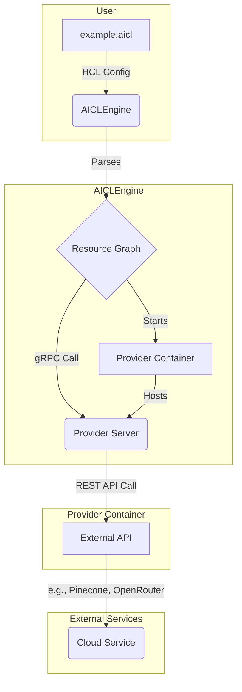

# Architecture Overview

This document describes the high-level architecture of the `tofu-aicl` framework. It is a container-native system that uses a central engine to orchestrate specialized, single-purpose providers via gRPC.

## Workflow Diagram

## Core Components

*   **AICLEngine:** The central orchestrator. It parses HCL files, manages state, and communicates with provider containers.
*   **Provider Containers:** Lightweight Docker containers that each expose a single gRPC service for a specific API (e.g., `pinecone`, `openrouter`).
*   **gRPC Protocol:** The universal API contract (`provider.proto`) that all providers must implement.
*   **.aicl Files:** Declarative HCL files that define the desired state of the AI infrastructure.