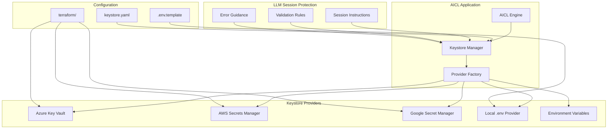
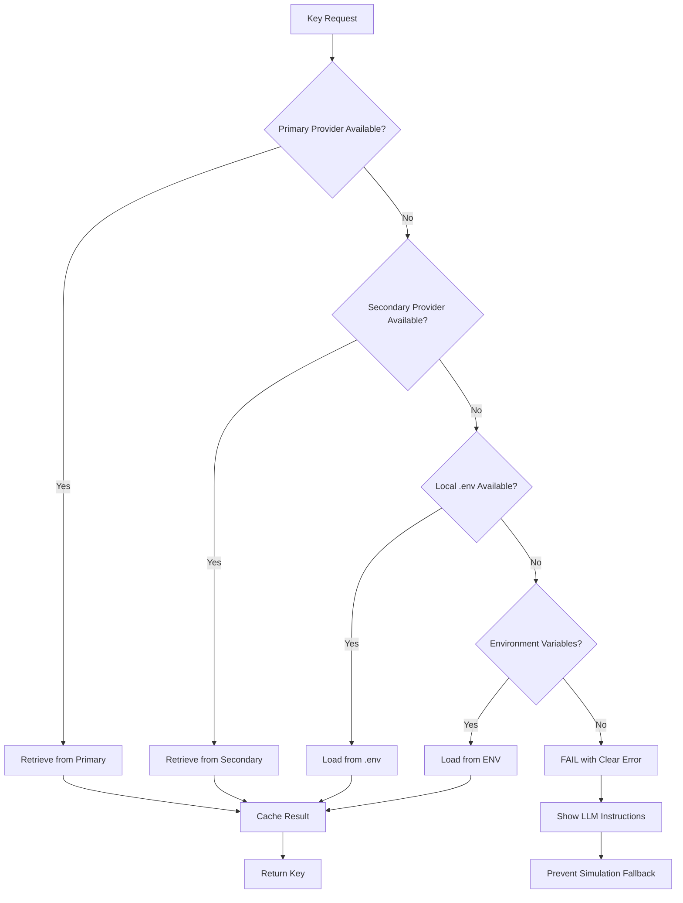

# AICL Keystore Architecture Design Document

## 🎯 Problem Statement

**Issue**: Previous LLM sessions defaulted to simulation code when API keys were missing from `.env` files, leading to fake results instead of real API integration. The `.env` file was deleted, causing authentication failures that went undetected.

**Root Cause**: No centralized, persistent keystore solution with proper fallback mechanisms and LLM session guidance.

## 📋 Requirements

### Functional Requirements
1. **Multi-Provider Support**: AWS Secrets Manager, Azure Key Vault, Google Secret Manager
2. **Local Fallback**: Support for local `.env` files when cloud access unavailable
3. **LLM Guidance**: Clear instructions to prevent simulation fallbacks
4. **Environment Isolation**: Dev/staging/prod key separation
5. **Audit Trail**: Track key access and usage
6. **Auto-Discovery**: Detect available keystore providers
7. **Secure Defaults**: Fail securely when keys unavailable

### Non-Functional Requirements
1. **Performance**: < 500ms key retrieval
2. **Availability**: 99.9% uptime with local fallback
3. **Security**: Encryption at rest and in transit
4. **Compliance**: SOC2/GDPR compatible
5. **Usability**: Single configuration for multiple environments

## 🏗️ Architecture Overview



## 🔧 Provider Implementations

### 1. Azure Key Vault Provider

**Strengths:**
- Native Azure integration
- RBAC and managed identity support
- Terraform provider mature
- Cost-effective for Azure workloads

**Configuration:**
```yaml
providers:
  azure_keyvault:
    vault_url: "https://aicl-keys.vault.azure.net/"
    tenant_id: "${AZURE_TENANT_ID}"
    client_id: "${AZURE_CLIENT_ID}"
    client_secret: "${AZURE_CLIENT_SECRET}"
    managed_identity: true  # Preferred in Azure
```

**Terraform Setup:**
```hcl
resource "azurerm_key_vault" "aicl_keys" {
  name                = "aicl-keys-${var.environment}"
  location            = var.location
  resource_group_name = var.resource_group_name
  tenant_id          = data.azurerm_client_config.current.tenant_id
  sku_name           = "standard"
  
  access_policy {
    tenant_id = data.azurerm_client_config.current.tenant_id
    object_id = data.azurerm_client_config.current.object_id
    
    secret_permissions = [
      "Get", "List", "Set", "Delete"
    ]
  }
}

resource "azurerm_key_vault_secret" "openai_api_key" {
  name         = "openai-api-key"
  value        = var.openai_api_key
  key_vault_id = azurerm_key_vault.aicl_keys.id
}
```

### 2. AWS Secrets Manager Provider

**Strengths:**
- Automatic rotation capabilities
- Fine-grained IAM policies
- Cross-region replication
- Integration with AWS services

**Configuration:**
```yaml
providers:
  aws_secrets:
    region: "us-west-2"
    secret_prefix: "aicl/${var.environment}/"
    role_arn: "arn:aws:iam::account:role/AICLSecretsRole"
```

**Terraform Setup:**
```hcl
resource "aws_secretsmanager_secret" "aicl_keys" {
  name        = "aicl/${var.environment}/api-keys"
  description = "AICL API keys for ${var.environment}"
  
  replica {
    region = "us-east-1"
  }
}

resource "aws_secretsmanager_secret_version" "aicl_keys" {
  secret_id = aws_secretsmanager_secret.aicl_keys.id
  secret_string = jsonencode({
    openai_api_key    = var.openai_api_key
    openrouter_api_key = var.openrouter_api_key
    azure_openai_key  = var.azure_openai_key
  })
}
```

### 3. Google Secret Manager Provider

**Strengths:**
- Global availability
- Automatic encryption
- Audit logging built-in
- Integration with GCP services

**Configuration:**
```yaml
providers:
  gcp_secrets:
    project_id: "aicl-project"
    secret_prefix: "aicl-${var.environment}-"
    service_account_key: "${GCP_SERVICE_ACCOUNT_KEY}"
```

**Terraform Setup:**
```hcl
resource "google_secret_manager_secret" "openai_key" {
  secret_id = "aicl-${var.environment}-openai-key"
  
  replication {
    automatic = true
  }
}

resource "google_secret_manager_secret_version" "openai_key" {
  secret      = google_secret_manager_secret.openai_key.id
  secret_data = var.openai_api_key
}
```

## 🔄 Fallback Strategy



## 🛡️ LLM Session Protection

### Session Instructions File
```yaml
# .aicl/session-instructions.yaml
keystore:
  required: true
  error_handling:
    missing_keys: "STOP_AND_REQUEST_KEYS"
    simulation_fallback: "FORBIDDEN"
    
instructions:
  for_llm_sessions: |
    🚨 CRITICAL: API keys are required for real AICL operations
    
    If you encounter missing API keys:
    1. ❌ DO NOT create simulation code
    2. ❌ DO NOT use fake/hardcoded values  
    3. ✅ STOP and request user to configure keystore
    4. ✅ Guide user through keystore setup
    5. ✅ Verify real API connectivity before proceeding
    
    Available keystore options:
    - Azure Key Vault (recommended for Azure users)
    - AWS Secrets Manager (recommended for AWS users)
    - Google Secret Manager (recommended for GCP users)
    - Local .env file (development only)
    
  setup_commands:
    azure: "python -m aicl.keystore setup azure"
    aws: "python -m aicl.keystore setup aws"
    gcp: "python -m aicl.keystore setup gcp"
    local: "python -m aicl.keystore setup local"
```

## 📊 Implementation Priority Matrix

| Provider | Implementation Effort | User Adoption | Priority |
|----------|----------------------|---------------|----------|
| Azure Key Vault | Medium | High (existing Azure users) | **P0** |
| Local .env | Low | High (development) | **P0** |
| AWS Secrets Manager | Medium | Medium | **P1** |
| Google Secret Manager | Medium | Low | **P2** |
| Environment Variables | Low | Medium | **P1** |

## 🎯 Success Metrics

### Technical Metrics
- **Key Retrieval Time**: < 500ms (95th percentile)
- **Availability**: 99.9% uptime
- **Error Rate**: < 0.1% failed retrievals
- **Cache Hit Rate**: > 90%

### User Experience Metrics  
- **Setup Time**: < 5 minutes for any provider
- **Documentation Clarity**: > 4.5/5 user rating
- **LLM Session Success**: 100% prevention of simulation fallbacks
- **Support Tickets**: < 1 per month related to keystore

## 🚀 Implementation Phases

### Phase 1: Foundation (Week 1)
- [ ] Core keystore manager interface
- [ ] Azure Key Vault provider
- [ ] Local .env provider with validation
- [ ] LLM session instruction system
- [ ] Basic error handling and guidance

### Phase 2: AWS Integration (Week 2)  
- [ ] AWS Secrets Manager provider
- [ ] Terraform modules for AWS
- [ ] Cross-provider failover testing
- [ ] Performance optimization

### Phase 3: GCP Integration (Week 3)
- [ ] Google Secret Manager provider  
- [ ] Terraform modules for GCP
- [ ] Multi-cloud deployment examples
- [ ] Comprehensive testing suite

### Phase 4: Advanced Features (Week 4)
- [ ] Key rotation automation
- [ ] Audit logging and monitoring
- [ ] Performance dashboards
- [ ] Production hardening

## 📝 Configuration Examples

### Development Environment
```yaml
# config/keystore-dev.yaml
environment: development
primary_provider: local_env
fallback_providers: [environment_variables]

providers:
  local_env:
    file_path: ".env"
    required_keys: [OPENAI_API_KEY, OPENROUTER_API_KEY]
```

### Production Environment  
```yaml
# config/keystore-prod.yaml
environment: production
primary_provider: azure_keyvault
fallback_providers: [environment_variables]

providers:
  azure_keyvault:
    vault_url: "https://aicl-prod-keys.vault.azure.net/"
    managed_identity: true
    cache_ttl: 3600
```

## 🔒 Security Considerations

### Encryption
- **At Rest**: All providers use native encryption
- **In Transit**: TLS 1.3 for all communications
- **In Memory**: Keys cleared after use
- **Cache**: Encrypted local cache with TTL

### Access Control
- **Azure**: RBAC with managed identities
- **AWS**: IAM policies with least privilege
- **GCP**: Service account with minimal permissions
- **Local**: File system permissions (600)

### Audit Trail
- All key access logged with timestamp
- User/session identification
- Success/failure tracking
- Anomaly detection for unusual access patterns

## 🧪 Testing Strategy

### Unit Tests
- Provider interface compliance
- Fallback mechanism validation
- Error handling scenarios
- Cache behavior verification

### Integration Tests
- End-to-end key retrieval
- Multi-provider failover
- Real cloud provider testing
- Performance benchmarking

### Security Tests
- Penetration testing
- Key exposure detection
- Access control validation
- Encryption verification

## 📚 Documentation Requirements

### User Documentation
- Quick start guide for each provider
- Terraform deployment examples
- Troubleshooting guide
- Migration from .env files

### Developer Documentation
- Provider interface specification
- Extension development guide
- Performance tuning guide
- Security best practices

### LLM Session Documentation
- Clear error messages and guidance
- Setup command examples
- Validation procedures
- Common pitfall prevention

---

**Next Steps**: Create Redmine issues for each implementation phase and begin with Phase 1 development focusing on Azure Key Vault and local .env providers.
