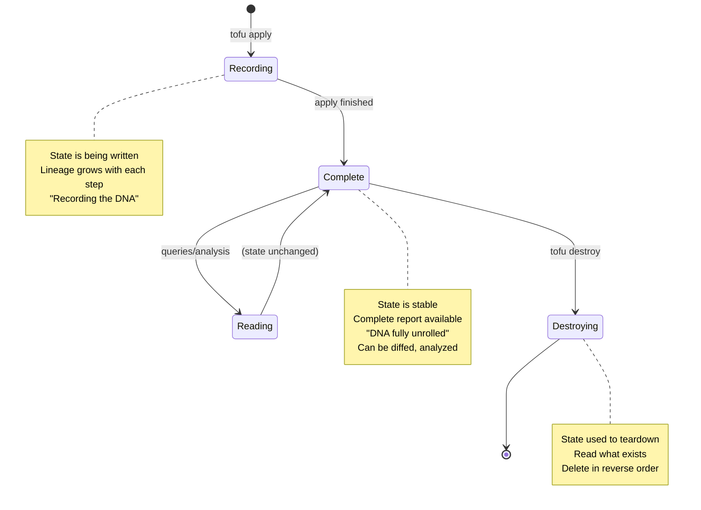

# State Lifecycle

## The DNA Metaphor at Each Stage

State acts differently at each stage of execution:

```
┌─────────────┐
│   [Start]   │
└──────┬──────┘
       │
       ▼
┌─────────────────────────┐
│   RECORDING             │  State is being written
│   "Recording the DNA"    │  Lineage grows with each step
└──────┬──────────────────┘
       │
       ▼
┌─────────────────────────┐
│   COMPLETE              │  State is stable
│   "DNA fully unrolled"  │  Complete report available
│                         │  Can be diffed, analyzed
└──────┬──────────────────┘
       │
       ├─► READING ──┐     State unchanged
       │            │     Used for queries
       └────────────┘     Comparisons
       │
       ▼
┌─────────────────────────┐
│   DESTROYING            │  State guides teardown
│   "Reading the DNA"     │  Resources deleted in
│                         │  reverse dependency order
└──────┬──────────────────┘
       │
       ▼
    [End]
```

## Phase 1: Recording (tofu apply)

**What Happens:**
- State file created (if new) or loaded (if exists)
- As each resource/step executes:
  - Lineage entry appended
  - Current state updated
  - File saved after each significant action

**State Characteristics:**
- Growing dynamically
- Being written to disk frequently  
- Not yet complete
- Intermediate snapshots valid

**Example:**
```python
# In StateManager
def record_action(self, action_type, resource, input, result):
    self.lineage.append({
        "timestamp": datetime.now().isoformat(),
        "action": action_type,
        "resource": resource.id,
        "input": input,
        "result": result
    })
    self.save()  # Write to disk after each action
```

## Phase 2: Complete (apply finished)

**What Happens:**
- All resources provisioned
- All pipelines executed
- Final state saved
- State file now represents complete "DNA"

**State Characteristics:**
- Stable and unchanging
- Complete historical record
- All dependencies resolved
- Ready for analysis

**Use Cases:**
```bash
# Compare experiments
git diff exp_001.tfstate exp_002.tfstate

# Analyze results
cat exp_001.tfstate | jq '.outputs'

# Check what was created
cat exp_001.tfstate | jq '.current_state.infrastructure'

# Review timeline
cat exp_001.tfstate | jq '.lineage[] | {time: .timestamp, action: .action}'
```

## Phase 3: Reading (queries, no changes)

**What Happens:**
- State file read but not modified
- Used for:
  - Status queries (`tofu state list`)
  - Resource inspection (`tofu state show`)
  - Dependency analysis
  - Cost calculations
  - Performance reports

**State Characteristics:**
- Read-only
- Multiple processes can read simultaneously
- No locking needed

**Example:**
```bash
# Show all resources
tofu state list

# Show specific resource
tofu state show pinecone_index.embeddings

# Get outputs
tofu output
```

## Phase 4: Destroying (tofu destroy)

**What Happens:**
- State file loaded
- Read current infrastructure state
- Delete resources in **reverse dependency order**
- Record deletion in lineage
- Final state shows empty infrastructure

**State Characteristics:**
- Being read for teardown plan
- Being updated as resources deleted
- Lineage shows deletion timeline
- Infrastructure section becomes empty

**Example:**
```python
# In Engine.destroy()
1. Load state
2. Topological sort (reverse)
3. For each resource:
   - Call DeleteResource()
   - Record deletion in lineage
   - Remove from current_state.infrastructure
   - Save state
4. Final state has:
   - Full lineage (including deletions)
   - Empty infrastructure
   - Historical outputs preserved
```

## State Transition Diagram



## Important Behaviors

### Recording Phase
- ✅ Frequent saves (after each action)
- ✅ Append-only lineage
- ✅ State is always valid (even if incomplete)
- ❌ No concurrent writes (git handles conflicts)

### Complete Phase
- ✅ Diff-able with other experiments
- ✅ Reproducible (contains all info to recreate)
- ✅ Shareable (commit to git, PR review)
- ✅ Archivable (just a JSON file)

### Destroying Phase
- ✅ Safe (uses state to know what to delete)
- ✅ Ordered (dependencies respected)
- ✅ Tracked (deletions recorded in lineage)
- ⚠️ Partial state if destroy interrupted

## Error Handling

### If Apply Fails Mid-Way
- State contains partial lineage
- Shows exactly what succeeded
- Shows exactly where it failed
- Can be inspected for debugging
- Next apply continues from current state

### If Destroy Fails Mid-Way
- State shows what's been deleted
- Shows what still exists
- Can retry destroy
- Manual cleanup possible with state as guide

## Next Steps

See `05-remote-backend.md` for when S3/DynamoDB makes sense instead of git.
