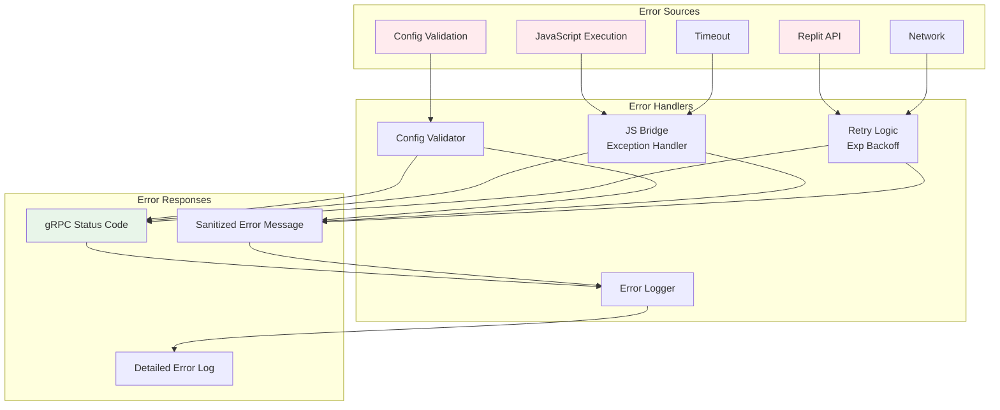

# Error Handling Architecture

## Error Flow



## Error Handling Strategy

### 1. Config Validation
- **Action**: Fail fast with INVALID_ARGUMENT
- **When**: Before any external calls
- **Response**: Detailed validation message

### 2. JavaScript Errors
- **Action**: Catch, sanitize, return INTERNAL
- **When**: Node.js subprocess fails
- **Response**: Sanitized error message (no file paths, tokens)

### 3. API Errors
- **Action**: Retry with exponential backoff
- **When**: Replit API returns error
- **Retries**: 3 attempts (100ms, 200ms, 400ms)
- **Response**: Specific error code with context

### 4. Timeouts
- **Action**: Return DEADLINE_EXCEEDED
- **When**: Operation exceeds timeout
- **Response**: Timeout duration and operation

### 5. Network Errors
- **Action**: Retry 3x, then UNAVAILABLE
- **When**: Network connectivity issues
- **Response**: Retry count and final error

## Error Sanitization

```python
def _sanitize_error(self, error: Exception) -> str:
    """Remove sensitive information from errors"""
    error_str = str(error)

    # Remove file paths
    error_str = re.sub(r'/Users/[^/]+/.*?\.py', '[path]', error_str)

    # Remove tokens
    error_str = re.sub(r'eyJ[A-Za-z0-9-_=]+\.[A-Za-z0-9-_=]+\.?[A-Za-z0-9-_.+/=]*',
                       '[token]', error_str)

    # Remove API keys
    error_str = re.sub(r'sk-[A-Za-z0-9]{48}', '[api_key]', error_str)

    return error_str
```

## Retry Logic

```python
for attempt in range(max_retries):
    result = self.execute(js_code, timeout)

    if result.success:
        return result

    # Don't retry timeouts or invalid JSON
    if "timed out" in result.error or "Invalid JSON" in result.error:
        return result

    # Exponential backoff
    if attempt < max_retries - 1:
        backoff_ms = 100 * (2 ** attempt)
        time.sleep(backoff_ms / 1000)
```