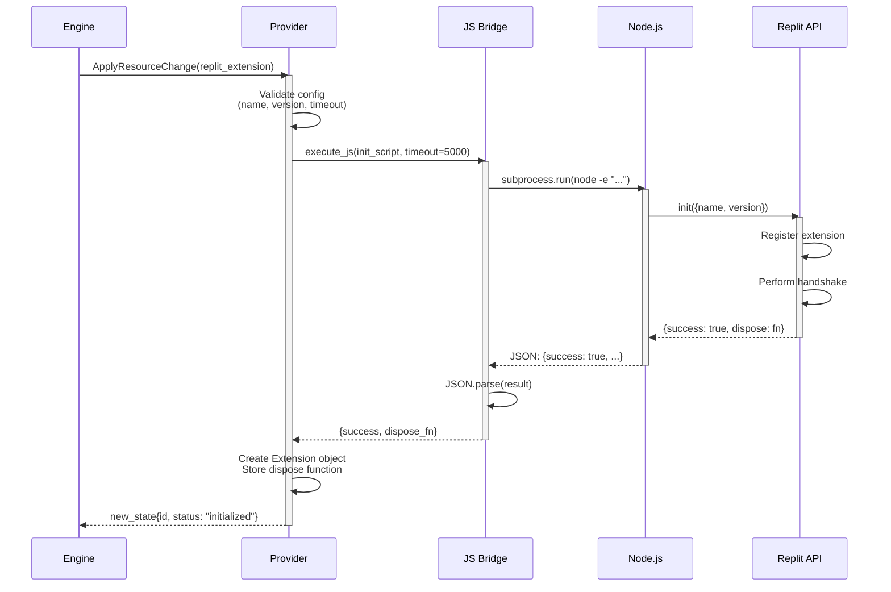
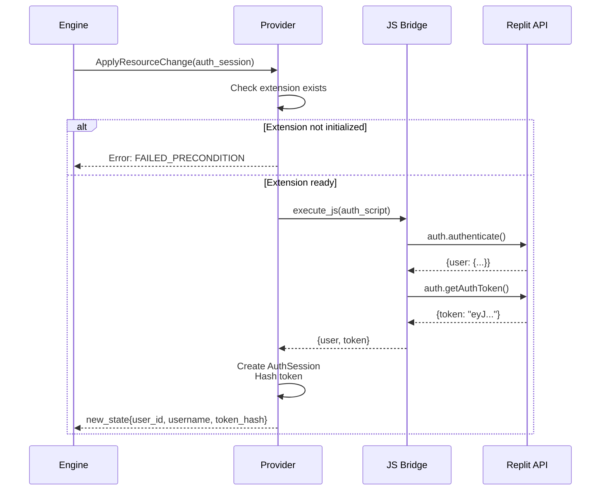
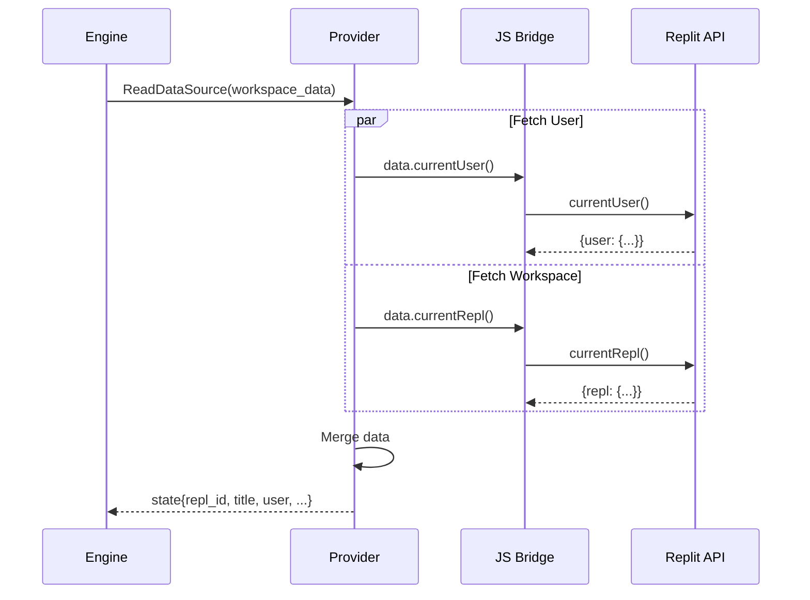
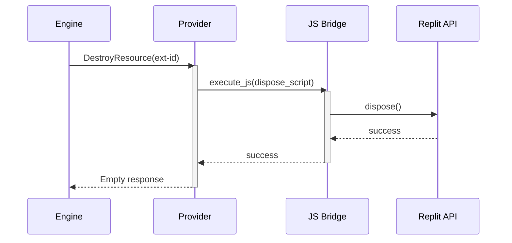

# Resource Lifecycle Flows

## Extension Initialization

**Key Steps:**
1. Engine requests extension creation
2. Provider validates config
3. JavaScript bridge spawns Node.js
4. Replit API performs handshake
5. Dispose function stored
6. State returned to engine

---

## Authentication Flow

**Key Steps:**
1. Check extension prerequisite
2. Call authenticate() and getAuthToken()
3. Hash token for security
4. Return session state

---

## Data Source Flow

**Key Steps:**
1. Parallel fetch (user + workspace)
2. Use Promise.all() for performance
3. Merge results
4. Return combined state

---

## Resource Destruction

**Key Steps:**
1. Call stored dispose function
2. Clean up Replit extension
3. Return success