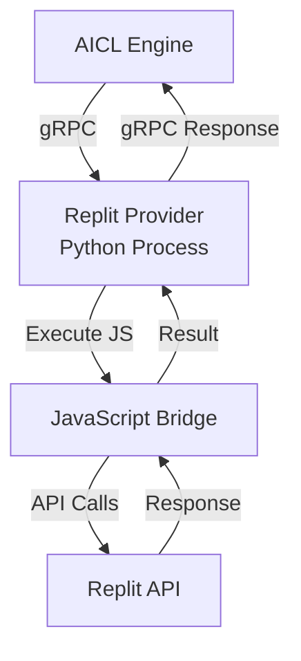
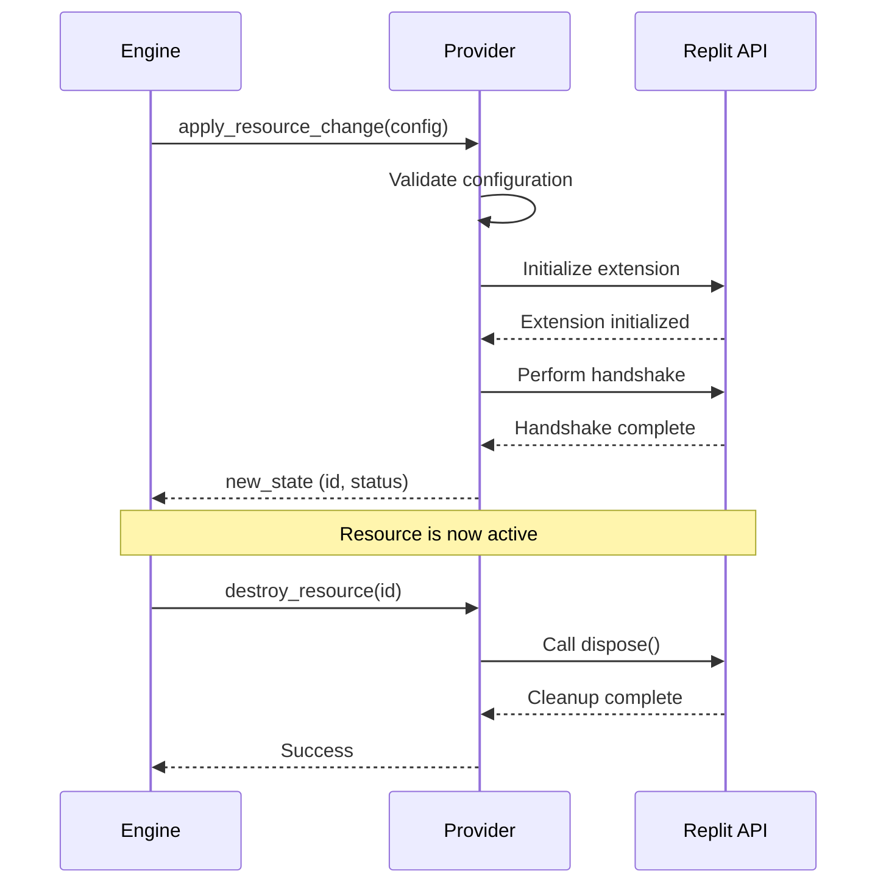

# Design Specification Template
# (Copy to docs/designs/your-feature-spec.md)

**Project Name:** tofu-aicl
**Component:** [PROVIDER_NAME or FEATURE_NAME]
**Version:** 1.0
**Last Updated:** [DATE]
**Status:** [ ] Draft | [ ] Under Review | [ ] Approved | [ ] Amended
**Approved By:** [NAME/TEAM] on [DATE]

---

## 1. Design Statements (The Contract)

> Declarative rules that govern this component. Each statement must be testable and unambiguous.

### Core Principles
- The [component] SHALL [principle 1]
- The [component] SHALL [principle 2]
- The [component] SHALL NOT [anti-pattern to avoid]
- The [component] MUST [critical requirement]

### Functional Requirements
- [Component/Module] SHALL [specific behavior]
- [Component/Module] SHALL [specific behavior]
- [Component/Module] SHALL handle [edge case]

### Non-Functional Requirements
- Performance: [specific measurable requirement]
- Security: [specific security rule]
- Scalability: [specific scaling requirement]
- Reliability: [specific reliability rule]

**Example for Replit Provider**:
```
- The Replit provider SHALL implement the gRPC ProviderServicer interface
- The provider SHALL support three resource types: extension, auth_session, workspace_data
- The provider SHALL communicate with Replit APIs via JavaScript bridge
- The provider SHALL NOT use localStorage or browser storage APIs
- The provider MUST handle network failures gracefully with retry logic
```

---

## 2. API Specifications

> Complete specification of all functions, methods, and resources.

### Resource Type: [RESOURCE_TYPE_NAME]

#### Configuration Schema
```python
class ResourceConfig:
    """
    Configuration for [resource_type] resource
    """
    field1: Type1  # Description
    field2: Type2  # Description
```

#### State Schema
```python
class ResourceState:
    """
    State returned after resource provisioning
    """
    id: str
    status: str
    attributes: dict
```

---

### Provider Method: `apply_resource_change(request)`

**Purpose:** [One sentence description]

**Parameters:**
```python
request: ApplyResourceChangeRequest
    type_name: str         # Resource type identifier
    config: dict          # Resource configuration
    prior_state: dict     # Previous resource state (if any)
```

**Returns:** `ApplyResourceChangeResponse`
```python
{
    "new_state": {
        "id": str,
        "type": str,
        "status": str,
        "attributes": {
            "field1": value1,
            "field2": value2
        }
    }
}
```

**Throws/Errors:**
- `InvalidConfigError` - When: [condition]
- `ProvisioningError` - When: [condition]
- `CommunicationError` - When: [condition]

**Side Effects:**
- [What state changes occur]
- [What external systems are affected]
- [What logs are created]

**Performance Requirements:**
- Response time: [e.g., "< 1000ms for typical operations"]
- Timeout handling: [e.g., "5s timeout for external API calls"]

**Security Considerations:**
- [What data is sensitive]
- [What validations occur]
- [What is logged/not logged]

**Example Usage:**
```python
# Create replit_extension resource
request = ApplyResourceChangeRequest(
    type_name="replit_extension",
    config={
        "name": "AI Workflow Manager",
        "version": "1.0.0"
    },
    prior_state=None
)

response = provider.apply_resource_change(request)
# Returns: { "new_state": { "id": "ext-123", "status": "initialized", ... } }
```

---

### Provider Method: `read_resource(request)`

[Repeat structure above for each provider method]

---

## 3. Data Models

### Entity: [ENTITY_NAME]

**Schema:**
```python
class ReplitExtension:
    """
    Represents a Replit extension instance
    """
    id: str                    # Unique identifier
    name: str                  # Extension name (1-255 chars)
    version: str              # Semver version
    handshake_status: str     # "pending" | "complete" | "failed"
    dispose_function: Callable  # Cleanup function
    created_at: datetime      # Timestamp
    metadata: dict            # Additional properties
```

**Validation Rules:**
- `id`: Must be non-empty string
- `name`:
  - Required
  - Min length: 1, Max length: 255
  - Pattern: `^[a-zA-Z0-9\s\-_]+$`
- `version`:
  - Required
  - Must match semver pattern: `^\d+\.\d+\.\d+$`
- `handshake_status`:
  - Required
  - Must be one of: pending, complete, failed

**Relationships:**
- BELONGS_TO: ReplitWorkspace via workspace_id
- HAS_MANY: AuthSessions via extension_id

**Example Data:**
```python
ReplitExtension(
    id="ext-550e8400",
    name="AI Workflow Manager",
    version="1.0.0",
    handshake_status="complete",
    dispose_function=cleanup_handler,
    created_at=datetime(2025, 10, 5, 10, 0, 0),
    metadata={
        "auto_start": True,
        "permissions": ["read", "write"]
    }
)
```

---

## 4. Architecture Diagrams

### 4.1 Provider Architecture



**Components:**
- **AICL Engine**: Orchestrates provider lifecycle
- **Replit Provider**: Python gRPC service
- **JavaScript Bridge**: Executes Replit API calls
- **Replit API**: Workspace, user, and file APIs

**Communication Patterns:**
- Engine ↔ Provider: gRPC over local subprocess
- Provider ↔ Bridge: JavaScript execution via node subprocess
- Bridge ↔ Replit: Native Replit Extensions API

---

### 4.2 Resource Lifecycle



---

### 4.3 Data Flow

[Additional diagrams for error handling, state management, etc.]

---

## 5. Wireframes & User Flows

*Note: For backend providers, this section documents CLI/AICL usage patterns instead of UI*

### 5.1 Resource Configuration Pattern

**AICL Configuration Example:**
```hcl
resource "replit_extension" "ai_workflow" {
  name = "AI Workflow Manager"
  version = "1.0.0"

  # Optional configuration
  auto_start = true
  handshake_timeout = 5000  # milliseconds
}

# Use extension in other resources
resource "replit_authenticated_session" "user" {
  depends_on = [replit_extension.ai_workflow]

  required_permissions = ["read", "write"]
}
```

**User Experience:**
1. User writes .aicl configuration
2. Runs `python run.py config.aicl`
3. Engine provisions resources in order
4. Resources available for use
5. Automatic cleanup on completion

---

### 5.2 User Flow: Initialize Extension

**Flow:**
1. User includes `replit_extension` resource in config
2. Engine starts Replit provider
3. Provider initializes JavaScript bridge
4. Bridge calls Replit init API
5. Handshake completes
6. Resource state returned to engine
7. Resource ID available for interpolation

**Error Scenarios:**

*Scenario 1: Handshake timeout*
- When: Replit API doesn't respond within timeout
- System behavior: Retry 3 times with exponential backoff
- User sees: Error message with retry count
- Recovery: Increase timeout or check network

*Scenario 2: Permission denied*
- When: Extension lacks required permissions
- System behavior: Fail fast with clear error
- User sees: "Extension requires permissions: [list]"
- Recovery: Update extension permissions in Replit

---

## 6. Workflow Examples

### Workflow: Get Workspace Context for AI

**Use Case:** Retrieve current workspace information to provide context to AI model

**Actors:** AICL Engine, Replit Provider, OpenRouter AI

**Preconditions:**
- Replit extension initialized
- User authenticated

**Main Flow:**

**Step 1:** Get workspace data
```python
# Provider implementation
workspace_data = await self._fetch_workspace_context()
# workspace_data = {
#     "id": "repl-abc123",
#     "title": "tofu-aicl",
#     "language": "python",
#     "file_count": 47
# }
```

**Step 2:** Get user data
```python
user_data = await self._fetch_current_user()
# user_data = {
#     "id": "user-xyz789",
#     "username": "zacelston"
# }
```

**Step 3:** Return combined state
```python
return ResourceState(
    id=f"workspace-{workspace_data['id']}",
    type="replit_workspace_data",
    attributes={
        **workspace_data,
        **user_data
    }
)
```

**Success Criteria:**
- Workspace data retrieved successfully
- User data retrieved successfully
- Resource state contains all required fields

**Error Scenarios:**

*Network Failure*
```python
try:
    workspace_data = await self._fetch_workspace_context()
except NetworkError as e:
    # Retry with exponential backoff
    workspace_data = await self._retry_with_backoff(
        self._fetch_workspace_context,
        max_retries=3
    )
```

**Example Execution:**
```hcl
# In .aicl file
data "replit_workspace_data" "current" {
  include_files = true
  include_user = true
}

resource "openrouter_chat" "code_analysis" {
  model = "anthropic/claude-3.5-sonnet"

  messages = [{
    role = "user"
    content = "Analyze the code in ${data.replit_workspace_data.current.title}"
  }]

  context = jsonencode({
    workspace = data.replit_workspace_data.current.title
    language = data.replit_workspace_data.current.language
    user = data.replit_workspace_data.current.username
  })
}
```

---

## 7. POC Validation Results

### POC Test 1: JavaScript Bridge Communication

**Assumption Being Tested:**
Python subprocess can execute JavaScript code that calls Replit API and retrieve results

**Hypothesis:**
We can use Node.js subprocess to execute Replit Extension API calls and parse the JSON results back to Python

**Test Approach:**
Create minimal Python script that spawns Node.js process, executes Replit init() call, and captures output

**POC Code:**
```python
# File: docs/pocs/replit-js-bridge-poc.py
import subprocess
import json

js_code = """
const { init } = require('@replit/extensions');

(async () => {
    try {
        const dispose = await init();
        console.log(JSON.stringify({
            success: true,
            message: 'Extension initialized'
        }));
    } catch (error) {
        console.log(JSON.stringify({
            success: false,
            error: error.message
        }));
    }
})();
"""

result = subprocess.run(
    ['node', '-e', js_code],
    capture_output=True,
    text=True,
    timeout=10
)

output = json.loads(result.stdout)
print(f"Success: {output['success']}")
```

**Results:**
- ✅ JavaScript execution from Python: SUCCESS
- ✅ JSON serialization: SUCCESS
- ❌ Timeout handling: NEEDS IMPROVEMENT
- ✅ Error propagation: SUCCESS

**Observations:**
- Communication works but needs robust error handling
- Timeout of 10s is sufficient for init, may need adjustment for other calls
- JSON parsing works well for structured data

**Conclusion:**
- [x] Assumption VALIDATED - proceed with design
- [ ] Assumption INVALIDATED - design must change
- [ ] Assumption PARTIAL - design needs adjustment

**Design Implications:**
- Use subprocess.run with timeout for all JavaScript calls
- Wrap all JS calls in try-catch and return JSON
- Need helper function to execute JS and parse results
- Add retry logic for network-related failures

**Date Tested:** 2025-10-05
**Tested By:** Zac Elston

---

### POC Test 2: Workspace Data Retrieval

**Assumption Being Tested:**
We can reliably retrieve workspace metadata (title, language, files) via Data API

**Hypothesis:**
The `data.currentRepl()` API returns consistent, complete workspace information

**Test Approach:**
[POC test details]

**Results:**
[To be completed]

---

## 8. Design Amendments Log

| Date | Amendment # | Section | Change Description | Reason | Approved By | Status |
|------|-------------|---------|-------------------|--------|-------------|--------|
| | | | | | | |

**Amendment Process:**
1. Deviation discovered during implementation
2. Developer documents reason and proposes amendment
3. Team reviews justification
4. If approved: Update design doc, log amendment, continue
5. If rejected: Revert implementation to spec

**Amendment Statistics:**
- Total amendments: 0
- Approved: 0
- Rejected: 0
- Under review: 0

---

## 9. Approval & Sign-Off

**Design Review Checklist:**
- [ ] All design statements are testable and unambiguous
- [ ] API specifications are 100% complete
- [ ] All provider methods have error conditions documented
- [ ] Data models include validation rules
- [ ] Architecture diagrams show all components
- [ ] Workflow examples are executable
- [ ] All risky assumptions validated via POC
- [ ] Performance requirements specified
- [ ] Security considerations documented

**Approval Signatures:**

| Role | Name | Signature | Date |
|------|------|-----------|------|
| Technical Lead | | | |
| Project Owner | | | |

**Status:**
- [ ] APPROVED - Ready for implementation
- [ ] APPROVED WITH CONDITIONS - [List conditions]
- [ ] REJECTED - [List reasons]

**Next Steps After Approval:**
1. Lock this version of design spec
2. Create implementation branch
3. Begin coding per specification
4. Daily compliance reviews

---

## 10. Reference Materials

**Related Documents:**
- Project Wiki: `/Users/zacelston/code/tofu-aicl/docs/`
- Development Standard: `/Users/zacelston/code/tofu-aicl/docs/DEVELOPMENT_STANDARD.md`
- API Research: `/Users/zacelston/code/tofu-aicl/APIDocs/`

**External References:**
- Replit Extensions Docs: https://docs.replit.com/extensions
- tofu-aicl Architecture: `/Users/zacelston/code/tofu-aicl/docs/architecture/`

**Tools & Configuration:**
- Design Tool: Markdown + Mermaid
- Diagram Tool: Mermaid
- AI Context System: MCP + Claude

---

**Document Control:**
- Template Version: 1.0 (tofu-aicl specific)
- Created: [DATE]
- Last Modified: [DATE]
- Next Review: [DATE]